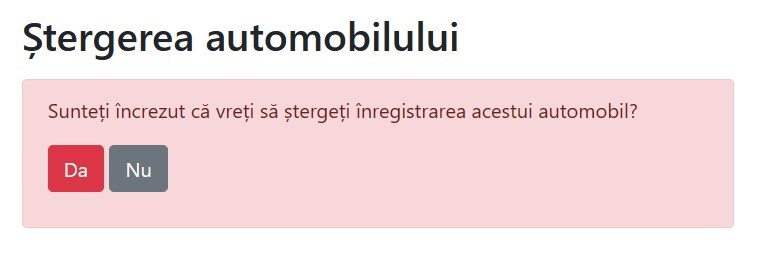

# Descrierea generală a proiectului
Implementarea a unui sistem **CRUD** (acronim englez Create, Read, Update și Delete) bazat pe server local **XAMPP** (server web **Apache** pe care se execută script-uri cu extensia **.php** pentru legătura cu server-ul **MySQL**). Acest proiect este bazat pe o lucrare de laborator realizată în cadrul unui curs universitar de web pe tema "Salon Auto" cu divizarea domeniului informațional în 3 entități majore - Angajați, Filiale și Automobile.

Am realizat implementarea conceptului **MVC** (**Model-View-Controller**), unde Model este reprezentat de tabelele bazei de date MySQL, View de către **HTML/CSS**, iar Controller de **JavaScript** (JS) și **PHP**. La fel am implementat conceptul **ORM** (**Object Relational Mapping**), adică am realizat legătura dintre obiecte **OOP** și baze de date (în cadrul extensiei **MySQLi**). Deși mai mult am utilizat programarea procedurală PHP 8.0 (functions).

Am validat formularele, implementând măsuri de protecție contra atacurilor de tip **Cross-site Scripting (XSS)**, și anume am utilizat funcția **htmlspecialchars()** din PHP ce evită posibilitatea înserării de cătrea utilizator a tag-urilor JavaScript **** în oarecare **input** din **form**.

Am garantat o oarecare optimizare a interogărilor SQL prin selectarea economă a tipurilor de date și a dimensiunilor câmpurilor la crearea tabelelor, de exemplu pentru un câmp ce păstrează numărul de angajați al unei filiale am stabilit **INT(3)** deoarece cunoaștem că conform legislației în vigoare a Republicii Moldova un SRL poate avea maxim 250 de angajați, etc...

La fel, cât ține de aspectul de securitate am realizat implementarea măsurilor de protecție contra atacului de tip **SQL Injection** prin implementarea **prepared statements** cu **placeholdere ?**, de care ulterior legam variabilele ca parametri prin **mysqli_stmt_bind_param()**.

Am realizat implementarea sesiunilor și autentificarea utilizatorilor privelegiați. Aici mai întâi prealabil am criptat parola **Angeles#96** prin intermediul funcției **password_hash()** cu parametrul **PASSWORD_DEFAULT**, adică am criptat parola cu un algoritm puternic **bcrypt** contra atacurilor de tip **brute-force**, la fel deoarece prealabil am salvat în tabelul users al bazei de date hash-ul parolei, am evitat prin aceasta păstrarea acesteia ca plaintext în cod. După doar realizăm verificarea dacă parola introdusă de către utilizator corespunde cu hash-ul salvat în BD prin intermediul funcției **password_verify()**.

Citirea și scrierea în fișiere are loc utilizând funcțiile PHP pentru lucru cu fișierele **fopen()**, **fgets()**, **fwrite()**, **implode()** și **explode()**.

